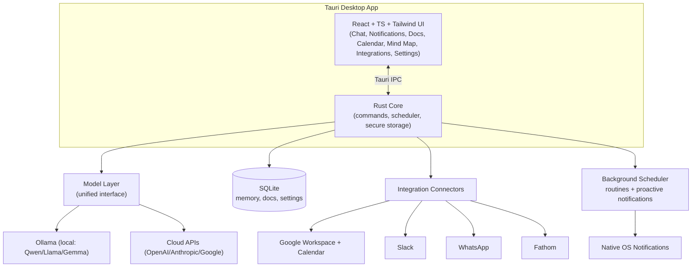

# Donna — Project Context

> This document is the single source of truth for what Donna is, why it exists, how
> it is architected, and where it is going. It is written for both humans and AI
> coding agents working on the project. Read it before contributing.

---

## 1. Vision

**Donna is an open-source, local-first AI personal assistant that actually knows you.**

Most AI tools treat every user the same — no memory, no context, no awareness of who
you are or how you work. Donna is the opposite. She runs on *your* machine, learns
about *you* over time, connects to *your* tools, and proactively does work the way you
would do it.

Donna is named after the famously capable assistant who anticipates needs before they
are spoken. That is the bar.

### What makes Donna different
- **It's yours.** Runs locally. Your data lives on your device, not on someone's
  server. Nothing leaves your machine unless *you* connect an integration.
- **It learns you.** A persistent knowledge graph of facts, people, preferences, and
  routines that gets richer every conversation (inspired by [Cobblr](https://cobblr.ai/)).
- **It's proactive.** Donna doesn't just answer — she reminds, drafts, summarizes, and
  nudges on a schedule (inspired by [Town](https://www.town.com/)).
- **It's affordable.** Bring your own API key for frontier models, *or* run fully free
  with local models (Qwen, Llama, Gemma) via Ollama. No subscription, no per-message fee.
- **It's for everyone.** The north-star user is a non-technical person who can install
  an app, click "Connect Google," and have a working assistant in minutes.

---

## 2. Target User

The primary audience is **non-technical individuals** who want a capable personal
assistant without:
- writing code or editing config files,
- paying a recurring SaaS subscription,
- handing their private data to a third party.

Secondary audience: developers and tinkerers who want a hackable, self-hosted assistant
they can extend with new integrations and routines.

Design implication: **every core flow must be achievable through the UI alone.** The
terminal is for contributors, never for end users.

---

## 3. Product Pillars

1. **Local-first & private** — runs on the user's machine; data is local by default.
2. **Bring-your-own-intelligence** — one model layer abstracts local (Ollama) and cloud
   (OpenAI, Anthropic, Google) providers behind a single interface; the user picks.
3. **Easy for non-technical users** — one installer, a guided onboarding wizard,
   click-to-connect integrations, click-to-download local models.
4. **Proactive, not passive** — a background scheduler runs routines and pushes
   notifications without being asked.
5. **Open & extensible** — MIT licensed; integrations and routines are pluggable.

---

## 4. Core Features

Each feature corresponds to a primary view in the app.

### 4.1 Chat
The home base. The user converses with Donna to:
- ask questions, brainstorm, draft, and summarize;
- **explicitly teach** her things ("Remember that I prefer morning meetings", "My
  manager is Alex, they care about brevity");
- ask her to **learn a routine** ("Every Friday, summarize my open tasks").

Chat is also where Donna surfaces what she has learned and asks for confirmation before
acting on the user's behalf.

**Formatted output**: Donna's replies are rendered as Markdown so they are easy to read
— `**bold**` becomes **bold**, lists, headings, inline `code`, code blocks, and links all
render properly (including while the response is still streaming).

### 4.2 Notifications
Donna proactively pushes **native OS notifications** to remind the user of things they
need to do, check on, or should consider. Examples:
- "You said you'd follow up with Marcus on the contract — want me to draft it?"
- "Your 3pm meeting prep is ready."
- "You haven't talked to Sarah in 3 weeks; want to reconnect?"

Driven by the **background scheduler** (see §7). Every notification is actionable
(snooze, dismiss, open, or let Donna handle it).

### 4.3 Docs
Donna creates documents automatically from events and information:
- **Meeting recaps**: when a meeting ends, pull the [Fathom](https://fathom.video/)
  transcript/summary and write a structured doc (requires the user to connect Fathom).
- **Important messages**: when something important is texted/emailed, write a doc
  capturing it and notify the user that a doc was created.
- **On request**: "Write a doc summarizing this project."

Docs are stored locally and can optionally sync to Google Docs/Drive.

### 4.4 Calendar
A personalized calendar view that connects two-way with **Google Calendar**:
- view the schedule, create/edit events;
- Donna can add prep blocks, focus time, and private event copies (e.g. meeting
  briefings) on the user's behalf, with confirmation.

### 4.5 Integrations Hub
A single screen to connect/disconnect services via guided OAuth. Launch set:
Google Workspace (Gmail, Calendar, Docs, Drive), Slack, WhatsApp (inbound), Fathom.
Roadmap: Notion, Telegram, GitHub, Linear, and more.

### 4.6 Memory
A knowledge graph of everything Donna learns — facts, people, projects, preferences,
routines. Visible and editable by the user (privacy + trust). See §6.

### 4.7 Mind Map (Folder-based Knowledge Base)
A visual, node-based map backed by a real **folder system on disk** — the user's local
knowledge base, rendered as cartography.
- **Folders are categories, files are nodes**: each top-level folder is a category; each
  file inside it preserves the content of one node. A node file is Markdown (Donna's
  description for later recall) and may carry an **image**.
- **Sub-folders are branches**: nesting a folder inside a category creates a branch in
  the map, so the hierarchy of folders *is* the shape of the mind map.
- **Donna decides what to save**: after a conversation she judges whether anything is
  worth remembering. She only stores durable, user-specific knowledge — and she chooses
  the category/branch, writes the label, and writes the description she'll use to recall
  it. If nothing qualifies, nothing is saved (no more "unknown data" nodes).
- **What gets captured**: information about the user and their life/work/study, their
  routines, explicit feedback they give Donna, important people/projects, and other
  durable facts.
- **Click a node to read or edit**: selecting a file node shows Donna's note (and image);
  the user can edit the label, description, type, and category, attach/remove an image,
  or delete the node — changes are written straight back to the files.

This is the visual front-end of the §9 knowledge base.

---

## 5. Architecture



### Layers
- **UI (frontend)**: React + TypeScript + Vite + Tailwind. Renders the six views and
  the onboarding wizard. Talks to the core via Tauri IPC commands.
- **Rust Core (backend)**: hosts commands, the background scheduler, secure secret
  storage, and the SQLite database. The trust boundary for secrets lives here.
- **Model Layer**: a provider-agnostic interface (`chat`, `listModels`, `embed`) with
  concrete providers for Ollama and each cloud API. The active provider is chosen in
  Settings.
- **Integration Connectors**: per-service modules handling OAuth, token refresh, and
  the read/write actions Donna can perform.
- **Background Scheduler**: evaluates routines on a cadence and emits notifications.

---

## 6. Model Layer Design

A single interface so the rest of the app never cares whether intelligence is local or
cloud-based.

```ts
// conceptual
interface ChatMessage { role: "system" | "user" | "assistant"; content: string }

interface ModelProvider {
  id: string;                       // "ollama" | "openai" | "anthropic" | "google"
  listModels(): Promise<ModelInfo[]>;
  chat(messages: ChatMessage[], opts?: ChatOptions): AsyncIterable<string>; // streamed
  embed?(text: string): Promise<number[]>;
}
```

- **OllamaProvider** — talks to a local Ollama server (`http://localhost:11434`).
  Surfaces installed models and offers one-click downloads of recommended models
  (Qwen, Llama, Gemma). No API key, fully free, fully private.
- **OpenAIProvider / AnthropicProvider / GoogleProvider** — use the user's own API key
  (stored in the OS keychain). Used when the user wants frontier quality.

The user selects the active provider + model in **Settings**. Embeddings power the
memory/knowledge-graph retrieval; a local embedding model is preferred so memory works
offline.

---

## 7. Proactive Scheduler & Routines

Donna's "proactiveness" comes from a **background scheduler** in the Rust core that:
1. Stores **routines** (e.g. cron-like schedules: "every Friday 4pm", "every morning 8am").
2. On each tick, evaluates due routines, runs them through the model layer + relevant
   integrations, and produces an outcome (a draft, a doc, a summary, a reminder).
3. Emits a **native notification** and/or writes a doc, then records the result.

Example routines (inspired by Town): Morning Briefing, Meeting Briefing, Inbox triage,
Relationship Reconnect, Weekly task summary. Users can enable built-in routines or
describe their own in natural language.

---

## 8. Integrations

| Service | Category | Initial capabilities | Auth |
| --- | --- | --- | --- |
| Gmail | Google Workspace | read, search, draft, label | OAuth 2.0 |
| Google Calendar | Google Workspace | read, create, edit events | OAuth 2.0 |
| Google Docs / Drive | Google Workspace | create/read/update docs & files | OAuth 2.0 |
| Slack | Messaging | read channels, send messages | OAuth 2.0 |
| WhatsApp | Messaging | inbound messages to Donna | Provider API |
| Fathom | Meetings | pull transcripts & summaries | API key / OAuth |

**Auth approach**: OAuth flows are launched from the Integrations Hub. Tokens and API
keys are stored in the **OS keychain** (never in plaintext, never committed). Token
refresh is handled by the connector. Each integration declares the minimum scopes it
needs.

---

## 9. Knowledge Base (folder system on disk)

Donna's knowledge base is a **directory tree on the local machine**, not a database
table — so it is transparent, portable, and easy for the user to inspect or back up.

```
knowledge-base/            # gitignored; created on first run, never pushed
  About You/
    prefers-morning-meetings.md
  Routines/
    Mornings/              # sub-folder = a branch in the mind map
      journals-before-work.md
  Feedback/
    keep-replies-short.md
  People/
    alex-manager.md
    alex-manager.png        # an optional image attached to the node
```

- **Folder = category**, **sub-folder = branch**, **file = node**.
- Each node is a Markdown file with simple frontmatter and Donna's description:
  ```
  ---
  label: Prefers morning meetings
  type: preference
  image:
  updated: 2026-06-06T08:00:00Z
  ---
  The user schedules deep work in the afternoon and prefers meetings before noon.
  ```
- A node may reference an **image** stored alongside it in the same folder.

**Donna curates it.** After each conversation she runs a curation pass: the model judges
whether the conversation contains durable, user-specific knowledge (life/work/study,
routines, feedback, important people/projects). It returns only what is worth keeping,
each with a chosen category (and optional sub-category/branch), a label, a type, and a
description for recall. Donna then writes/updates the corresponding files. If nothing
qualifies, nothing is written.

**Storage & privacy.** The `knowledge-base/` folder lives next to the app and is
**gitignored**, so personal data is never pushed to GitHub. Anyone who clones the repo
gets the same structure created locally on first run, holding only their own data.

The Mind Map view (§4.7) reads this folder tree and lets the user edit nodes; edits are
written back to the files. A future **calibration** concept (inspired by Cobblr) can
score how well Donna knows the user and gate higher-autonomy actions.

---

## 10. Security & Privacy Model

- **Local-first**: all user data (chats, memory, docs, settings) is stored on-device in
  SQLite. No telemetry by default.
- **Secrets**: API keys and OAuth tokens are stored in the OS keychain via Tauri secure
  storage — never in the database, never in `.env`, never committed.
- **Least privilege**: integrations request the minimum scopes required.
- **User control**: every memory and every proactive action is visible, auditable, and
  reversible. High-impact actions require explicit confirmation.
- **Egress transparency**: when using a cloud model or integration, the user is clearly
  informed that data will leave the device for that request.

---

## 11. Tech Stack & Rationale

| Concern | Choice | Why |
| --- | --- | --- |
| App shell | **Tauri 2** | Small installer, low memory, native notifications, secure storage; far lighter than Electron for a polished local app. |
| Frontend | **React + TS + Vite + Tailwind** | Familiar to contributors, fast dev loop, easy to make beautiful. |
| Backend | **Rust** (Tauri core) | Safe, fast, good fit for the scheduler and secret handling. |
| Storage | **SQLite** | Zero-config, embedded, perfect for local-first. |
| Local models | **Ollama** | Easiest model runtime for non-technical users (one-click downloads). |
| Cloud models | **OpenAI / Anthropic / Google** | Frontier quality via the user's own key. |
| Secrets | **OS keychain** | Never store secrets in plaintext. |
| License | **MIT** | Maximally open and contributor-friendly. |

---

## 12. Repository Structure

```
donna/
├── README.md                  # Beautiful, user- and contributor-facing intro
├── CONTEXT.md                 # This file — project source of truth
├── LICENSE                    # MIT
├── .gitignore
├── .env.example               # Non-secret config template
├── package.json               # Frontend deps + scripts (tauri dev/build)
├── vite.config.ts
├── tsconfig.json
├── tailwind.config.ts
├── index.html
├── src/                       # Frontend (React + TS)
│   ├── main.tsx
│   ├── App.tsx                # Sidebar shell + routing
│   ├── routes/                # Chat, Notifications, Docs, Calendar, MindMap, Integrations, Settings
│   ├── components/            # Shared UI components (incl. Markdown renderer)
│   └── lib/
│       ├── models/            # Model provider catalog
│       └── memory/            # Knowledge graph client
├── src-tauri/                 # Backend (Rust + Tauri)
│   ├── Cargo.toml
│   ├── tauri.conf.json
│   └── src/
│       ├── main.rs
│       └── lib.rs             # Commands: chat, list_models, schedule, db init
└── docs/
    └── ROADMAP.md
```

---

## 13. Roadmap (phased)

### Phase 0 — Foundation (this milestone)
- Project scaffold, planning docs (this file + README), repo structure, build tooling.

### Phase 1 — MVP
- Onboarding wizard (pick local model via Ollama *or* paste an API key).
- Working Chat with the unified model layer (Ollama + at least one cloud provider).
- Local SQLite persistence for chats and basic memory.
- Settings (provider/model selection, keychain-backed keys).

### Phase 2 — Integrations
- Google Workspace OAuth (Gmail, Calendar, Docs/Drive).
- Calendar view with two-way Google Calendar sync.
- Slack + Fathom connectors.

### Phase 3 — Proactive routines
- Background scheduler + native notifications.
- Built-in routines (Morning Briefing, Meeting Briefing, Reconnect).
- Auto-doc generation from Fathom meetings and important messages.

### Phase 4 — Learning & voice
- Richer knowledge graph + retrieval.
- Voice/style calibration and tiered autonomy (confirm → act → autonomous).
- Custom user-described routines in natural language.

### Cross-cutting (shipped incrementally)
- **Formatted chat output**: Markdown rendering of Donna's replies (bold, lists, code,
  links) including during streaming.
- **Mind Map / Knowledge Cartography**: a node-based, clustered visualization of the
  knowledge graph that Donna continuously updates; click a node for Donna's note.

---

## 14. Contributing Notes for Agents & Humans
- Keep end-user flows UI-only; never require the terminal for non-technical users.
- Never store secrets outside the OS keychain. Never commit secrets.
- Prefer local-first defaults; make any data egress explicit to the user.
- Keep the model layer provider-agnostic — add providers, don't special-case callers.
- Update this file when architecture or scope changes.
