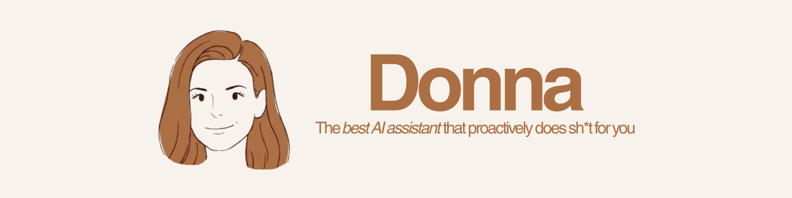

<div align="center">



### Your own AI personal assistant — private, local, and proactive.

Donna learns about *you*, connects to *your* tools, and gets work done the way you would.
She runs on your machine. Your data stays yours.

**[Download Donna →](https://duckyquang.github.io/Donna/)**

[](LICENSE)
[](https://tauri.app/)
[](https://ollama.com/)
[](#-contributing)

[Quick start](#-quick-start-for-everyone) ·
[Features](#-features) ·
[Models](#-bring-your-own-intelligence) ·
[Integrations](#-integrations) ·
[Privacy](#-your-data-stays-yours) ·
[For developers](#-for-developers)

</div>

---

## Why Donna?

Most AI tools forget you the moment you close the tab. Donna doesn't.

She remembers your people, your projects, and your preferences. She connects to your
email, calendar, and meetings. And she works *proactively* — drafting, reminding, and
summarizing before you ask — all from an app running on your own computer.

- **It's yours.** Runs locally. No subscription. No data sold.
- **It learns you.** A personal memory that gets sharper every conversation.
- **It's proactive.** Reminders, briefings, and drafts pushed to you automatically.
- **It's affordable.** Use free local models *or* bring your own API key for frontier models.
- **It's for everyone.** Install the app, click "Connect," done. No code required.

> Inspired by the magic of [Town](https://www.town.com/) and [Cobblr](https://cobblr.ai/) —
> rebuilt as an open-source, local-first assistant that anyone can run and own.

---

## Features

| | Feature | What it does |
| --- | --- | --- |
| 💬 | **Chat** | Talk to Donna, brainstorm, and teach her facts and routines about your life and work. |
| 🔔 | **Notifications** | Proactive, native reminders for what you need to do, check, or follow up on. |
| 📄 | **Docs** | Auto-creates documents — e.g. a recap when a meeting ends, or a note when something important arrives. |
| 📅 | **Calendar** | A personal calendar with two-way Google Calendar sync. |
| 🔌 | **Integrations** | One-click connections to Google Workspace, Slack, WhatsApp, Fathom, and more. |
| 🧠 | **Memory** | A private knowledge graph of people, projects, and preferences — fully visible and editable. |

---

## Quick start (for everyone)

No coding required. One download.

1. **Download Donna** from the [landing page](https://duckyquang.github.io/Donna/)
   (or grab an installer from [Releases](https://github.com/duckyquang/Donna/releases/latest)).
2. **Open it.** First launch on macOS: System Settings → Privacy & Security →
   **Open Anyway** (Donna isn't Apple-notarized yet). On Windows: **More info → Run
   anyway**. Once, and only once.
3. **Follow the onboarding.** Donna sets up her own brain — a free local model
   downloaded for you, or your own OpenAI/Anthropic/Google API key — then connects
   your tools from the Integrations page.

Everything else — her server, her memory, updates — is built in and automatic. Say
hi in the **Chat** tab.

---

## Bring your own intelligence

Donna runs on whatever brain you choose, behind one simple model layer.

| Type | Provider | Cost | Privacy |
| --- | --- | --- | --- |
| 🖥️ Local | **Ollama** — Qwen, Llama, Gemma, and more | Free | Fully on-device |
| ☁️ Cloud | **OpenAI** (GPT) | Your API usage | Sent to provider |
| ☁️ Cloud | **Anthropic** (Claude) | Your API usage | Sent to provider |
| ☁️ Cloud | **Google** (Gemini) | Your API usage | Sent to provider |

No money for API keys? Run entirely free and private with a local model. Want top
quality? Plug in your own key. Your choice, switchable anytime.

---

## Integrations

| Service | What Donna can do | Status |
| --- | --- | --- |
| Google Calendar | View, create, edit, and delete events (two-way sync) | Available |
| Slack | Read channels and send messages | Available |
| Fathom | Secure connection (meeting → doc actions land with Docs) | Available |
| Gmail | Read, search, draft, organize email | Auth ready (actions soon) |
| Google Docs / Drive | Create and update docs and files | Auth ready (actions soon) |
| WhatsApp | Send messages out (outbound) works today; two-way (Donna receiving and replying) is planned for Phase 3 — see the [server-first design spec](docs/superpowers/specs/2026-07-07-donna-jarvis-design.md) | Outbound available, two-way planned |
| Notion, Telegram, GitHub, Linear… | More connectors | On the roadmap |

See [`CONTEXT.md`](CONTEXT.md) for the full integration and auth design.

---

<a id="server-first-architecture"></a>
## Self-hosting the server (advanced)

Donna ships with her brain built in — the app runs a bundled `donna-server`
automatically, so most people never think about it. Self-hosting is for power users
who want a 24/7 assistant that works while their computer sleeps: run `donna-server`
on any always-on box and point **Settings → Server** at it.

Donna is evolving from a desktop-only app into a 24/7 assistant: an always-on
`donna-server` process now owns the database, knowledge base, and scheduler, and hosts
an RPC/WebSocket API; the desktop app is a client of it (like any other client would
be), showing an "unreachable" banner if the server goes down. See
[`docs/superpowers/specs/2026-07-07-donna-jarvis-design.md`](docs/superpowers/specs/2026-07-07-donna-jarvis-design.md)
for the full design and [`donna-server/README.md`](donna-server/README.md) for
deployment (Docker Compose + Cloudflare Tunnel).

---

## Skills

Donna can discover, use, and author her own **skills** — `SKILL.md` files (frontmatter
+ step-by-step instructions) that live on disk at `DONNA_SKILLS_DIR`
(`<data_dir>/skills` on the server). Every chat's system prompt lists the available
skills by name and description; Donna reads the full body before acting on one. She can
write a new skill herself when you ask her to, or accept a nightly-review suggestion
that turns a recurring recipe into a reusable skill. Browse and read the catalog on the
**Skills** page.

---

## Your data stays yours

- **Local-first.** Chats, memory, and docs are stored on your device in a local database.
- **No telemetry.** Donna doesn't phone home by default.
- **Secrets stay secret.** API keys and login tokens live in your OS keychain — never in
  plaintext, never committed to the repo.
- **You're in control.** Every memory and every proactive action is visible and
  reversible. When data needs to leave your device (cloud model or integration), Donna
  tells you.

---

## For developers

Donna is built with **Tauri 2** (Rust core) + **React + TypeScript + Vite + Tailwind**.

### Prerequisites
- [Node.js](https://nodejs.org/) 18+ and npm
- [Rust](https://www.rust-lang.org/tools/install) (stable) + Cargo
- Platform Tauri prerequisites — see the [Tauri guide](https://tauri.app/start/prerequisites/)
- (Optional) [Ollama](https://ollama.com/) for local models

### Run from source
```bash
# 1. Clone
git clone https://github.com/duckyquang/Donna.git
cd Donna

# 2. Install frontend dependencies
npm install

# 3. Build the donna-server sidecar (rerun after server changes)
npm run sidecar

# 4. Run the app in development
npm run tauri dev
```

### Build a production installer
```bash
npm run tauri build
```

See [`docs/BUILD.md`](docs/BUILD.md) for platform prerequisites, embeddings setup, and CI release tags.

### Project layout
```
donna/
├── src/          # React + TypeScript frontend (the UI)
├── src-tauri/    # Rust core (commands, scheduler, storage)
├── docs/         # Roadmap and design notes
├── CONTEXT.md    # Project source of truth — read this first
└── README.md     # You are here
```

Read [`CONTEXT.md`](CONTEXT.md) for the architecture, model layer, memory design, and
the full roadmap.

---

## Roadmap

- **Phase 0 — Foundation:** scaffold, docs, build tooling ✅
- **Phase 1 — MVP:** onboarding wizard, working chat, local persistence, settings ✅
- **Phase 2 — Integrations:** Google Workspace, calendar sync, Slack, Fathom ✅
- **Phase 3 — Proactive:** background scheduler, notifications, auto-docs, routines ✅
- **Phase 4 — Learning:** memory retrieval, autonomy tiers, custom routines ✅
- **Packaged app + landing page:** embedded server, hands-free onboarding, auto-updates, GitHub Pages site ✅

Full details in [`docs/ROADMAP.md`](docs/ROADMAP.md).

---

## Contributing

Contributions are welcome and appreciated. ❤️

1. Fork the repo and create a feature branch.
2. Read [`docs/CONTRIBUTING.md`](docs/CONTRIBUTING.md) and [`CONTEXT.md`](CONTEXT.md).
3. Make your change, keeping end-user flows UI-only and secrets out of the codebase.
4. Open a pull request with a clear description.

Found a bug or have an idea? [Open an issue](https://github.com/duckyquang/Donna/issues).

---

## License

[MIT](LICENSE) — free to use, modify, and distribute.

<div align="center">

**Donna** — the assistant that's actually yours.

</div>
