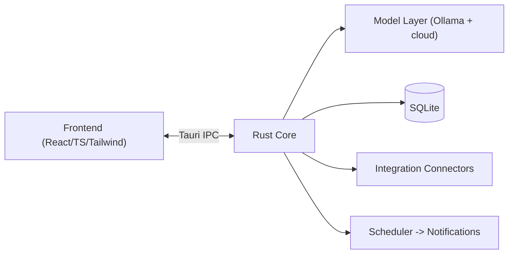

# Donna Architecture Notes

A quick map for contributors. The authoritative, detailed design lives in
[`../CONTEXT.md`](../CONTEXT.md); this file is the short version.

## High-level

## Where things live

| Concern | Location |
| --- | --- |
| UI views (Chat, Notifications, Docs, Calendar, Integrations, Settings) | `src/routes/` |
| Shared UI components | `src/components/` |
| Model provider interface + implementations | `src/lib/models/` |
| Knowledge-graph client | `src/lib/memory/` |
| Tauri commands (IPC surface) | `src-tauri/src/commands.rs` |
| App bootstrap + plugin registration | `src-tauri/src/lib.rs` |
| App/window/bundle config | `src-tauri/tauri.conf.json` |

## Key principles
1. **The model layer is provider-agnostic.** Callers depend on `ModelProvider`, never on
   a specific backend. Add providers; don't special-case callers.
2. **Secrets only in the OS keychain.** Never in SQLite, `.env`, or source.
3. **Local-first by default.** Any data egress (cloud model or integration) is explicit
   to the user.
4. **UI-only for end users.** Non-technical users never need the terminal.

## Data flow: a chat turn (Phase 1 target)
1. User sends a message in `src/routes/Chat.tsx`.
2. Frontend invokes the `chat` Tauri command (or calls the provider directly for local
   streaming, TBD in Phase 1).
3. Rust core resolves the active provider + model and retrieves any needed key from the
   keychain.
4. Tokens stream back to the UI; the turn and any learned facts are persisted to SQLite.
